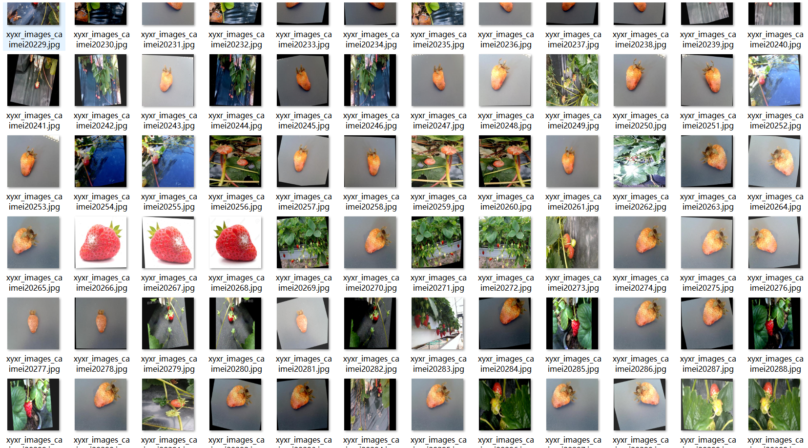
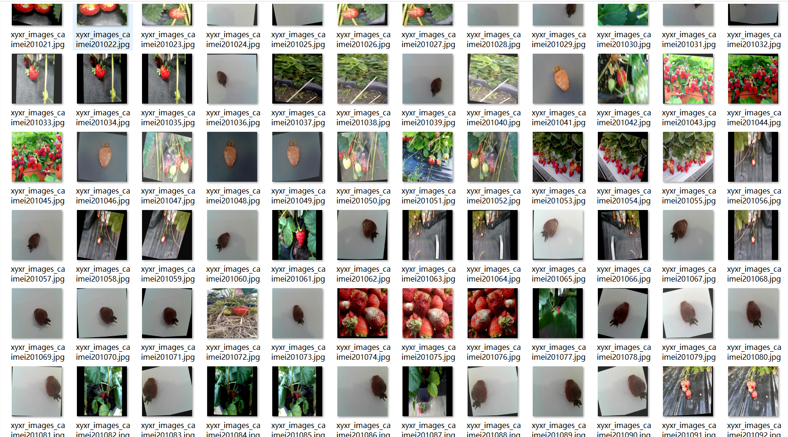

# Strawberry Ripeness Dataset 2632 images VOC+YOLO format

The strawberry ripeness dataset consists of 2632 images in VOC and YOLO format.

The dataset is organized into three folders: JPEGImages, Annotations, and labels. The JPEGImages folder contains a total of 2632 JPG images. The Annotations folder contains a total of 2632 XML files. The labels folder contains a total of 2632 txt files.

There are three types of labels: "ripe", "rotten", and "unripe". Each label has a corresponding number of boxes (yolo format categories) as follows:

- ripe boxes = 4338
- rotten boxes = 2163
- unripe boxes = 1871

Total boxes = 8372

The image resolution is clear.

The images have been enhanced.

The GitHub repository location is datasets_sl.

The shape of the labels is rectangular boxes, used for object detection recognition.

This dataset does not guarantee the accuracy or reliability of trained models or weight files. It only provides accurate and reasonable annotations.

The annotation and image details are as follows:

## Images

---

Here is a pay link on Stripe (https://buy.stripe.com/3cs8yP7sY87d0vu9AB). Please contact me lonlonago@foxmail.com after funding $89, and I will send you a complete data files, thank you!

